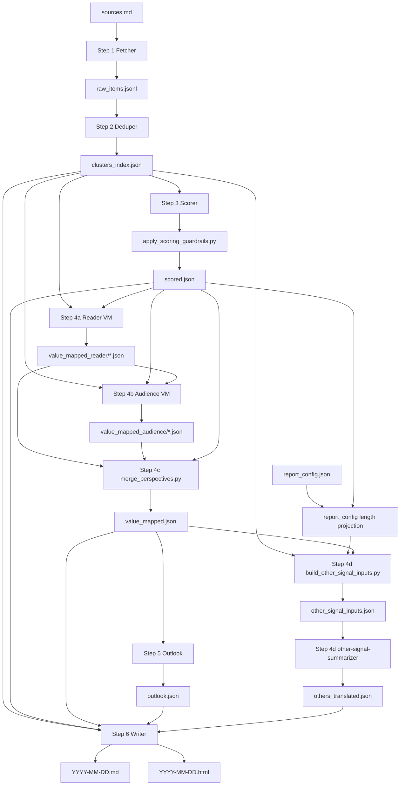

# Xier RSS Daily Brief Skill

个人标题：Xier RSS Daily Brief Skill

Xier 的可配置公开信源日报 Skill，用来帮不同用户建立自己的信息判断系统。

它的核心价值是**降噪**：先理解用户是谁、为什么读、读给谁，再决定信源、评分规则、价值视角和日报格式，最后把 RSS / 网页 / newsletter / podcast 这类高噪声公开信息流，转成可读、可用、可持续自动化的 Markdown / HTML 日报。

换句话说，它不是新闻聚合器，也不是通用摘要器。它先确认画像和价值标准，再配置公开信源，最后用稳定的抓取、去重、评分、价值解释和渲染流程，把“今天值得读什么、为什么值得读、对我有什么用”交付给用户。

## 为什么需要

- **从信息过载到信息判断**：不是把更多内容搬进日报，而是建立用户自己的筛选标准。
- **从通用摘要到个人相关性**：同一条新闻，对产品、市场、投资、政策、研究用户的价值不同，评分和解释也应不同。
- **从噪声列表到可行动日报**：低相关、重复、营销、订阅介绍、缺少细节的内容会被降权或放入背景信息。
- **从一次性提示词到稳定配置**：画像、信源、评分规则、价值视角和输出格式都能沉淀下来，适合长期自动跑。
- **从黑盒摘要到可追溯判断**：抓取、去重、来源健康是证据层；评分、价值解释、今日判断是判断层。

## 功能

- 读取或推荐公开 RSS / Atom / 归档页 / newsletter / 播客 show notes / blog
- 按用户画像和价值标准建立评分规则
- 对内容去重、聚类、分层，区分 `must_read`、`recommended`、`optional`、`others`
- 将英文等非目标语言内容转成用户需要的日报语言
- 生成跨信源的“今日判断”，避免逐条摘要堆叠
- 输出读者视角的价值判断，并可选输出目标受众视角
- 输出 Markdown、HTML，或两者同时输出
- 提供 `light`（明亮版）和 `dark`（黑夜版）两种 HTML 主题
- 将用户反馈沉淀为配置、评分规则或模板调整

不支持登录、cookie、验证码、付费墙、X / Twitter、微信、小红书、TikTok 等反爬或平台 API 工作流。运行中遇到 X / Twitter URL 会记录为 `unsupported_source_type`，不写入 `raw_items.jsonl`，不进入日报或 Other Signals；source 级 URL 会在信源状态中显示为“不支持的信源”。

## Agent 兼容

这是一个通用 Agent Skill。核心入口是根目录的 `SKILL.md`，同一份代码可以用于不同 agent：

| Agent | 安装路径 |
|---|---|
| Codex | `~/.codex/skills/xier-rss-daily-brief-skill/` 或 `.codex/skills/xier-rss-daily-brief-skill/` |
| Claude Code | `~/.claude/skills/xier-rss-daily-brief-skill/` 或 `.claude/skills/xier-rss-daily-brief-skill/` |
| Kimi Code | `~/.kimi/skills/xier-rss-daily-brief-skill/`、`.kimi/skills/xier-rss-daily-brief-skill/`，或 `kimi --skills-dir /path/to/skills` |

建议维护一份 Skill 源包，不要为不同 agent 分叉出多份 `SKILL.md`。

## 文字规范

- 面向用户的说明文字使用中文。
- 文件名、命令、JSON key、枚举值、tier、theme、Agent 名称保留英文。
- `SKILL.md` 的 frontmatter `description` 保留英文，帮助不同 agent 更稳定地触发 Skill。
- 日报输出语言由 `config/report_config.json` 的 `output_language` 控制。

## 目录结构

```text
.
├── SKILL.md                  # Agent Skill 入口
├── config/report_config.json # 输出格式、语言、主题、功能开关
├── references/               # 画像、信源、提示词、首次配置文档
├── scripts/                  # 抓取、去重、渲染等确定性脚本
└── assets/                   # Markdown 和 HTML 模板
```

关键文件：

| 文件 | 用途 |
|---|---|
| `references/PROFILE.md` | demo 用户画像，生产使用前应替换 |
| `references/scoring_profile.json` | Scorer 使用的结构化评分规则 |
| `references/scorer_input_contract.md` | Scorer 轻量输入字段 `rss_summary` / `content_excerpt` 的来源和边界 |
| `references/angle_config.json` | Reader/Audience angle key 与中文 label |
| `references/sources.md` | demo 信源列表，生产使用前应替换或重新生成 |
| `config/report_config.json` | 输出语言、格式、HTML 主题、功能开关 |
| `references/profile_onboarding.md` | 如何推导用户画像和评分规则 |
| `references/source_recommendation.md` | 用户没有信源时如何推荐初始信源 |
| `references/feedback_loop.md` | 如何把用户反馈变成稳定配置 |

## 安装

```bash
cd xier-rss-daily-brief-skill
bash scripts/bootstrap.sh
python3 scripts/healthcheck.py --root .
```

可选：检查 `sources.md` 中的公开 URL 是否可访问。

```bash
python3 scripts/healthcheck.py --root . --probe-sources
```

## 配置

生产使用前，先替换 demo 用户画像和 demo 信源。

1. 第一轮对齐读者画像、评分规则和读者价值视角：

```text
references/PROFILE.md
references/scoring_profile.json
references/perspectives/reader.md
references/angle_config.json
```

2. 第二轮确认是否有目标受众；如果有，再配置目标受众画像和价值视角：

```text
references/perspectives/audience.md
config/report_config.json
```

3. 第三轮编辑或生成信源：

```text
references/sources.md
```

4. 第四轮在 `config/report_config.json` 中选择输出格式、长度和主题：

```json
{
  "output_language": "zh",
  "html_theme": "light",
  "outputs": {
    "formats": ["markdown", "html"],
    "directory": "outputs/daily-brief"
  },
  "report_length": {
    "max_must_read": 3,
    "max_recommended": 5,
    "max_optional": 10,
    "show_other_table": true
  },
  "features": {
    "audience_view": true,
    "pillar_mapping": false,
    "translate_others_to_output_language": true
  }
}
```

`outputs.formats` 可选：

```json
["markdown"]
["html"]
["markdown", "html"]
```

`html_theme` 可选：

```json
"light"
"dark"
```

## 运行链路

稳定日报运行使用 Step 0-6：

```text
Step 0  准备运行目录
Step 1  抓取公开信源
Step 2  去重聚类
Step 3  用 AI 评分 + deterministic guardrail
Step 4  映射读者 / 目标受众价值
Step 4d 生成 Final Other Signals 中文摘要
Step 5  生成今日判断
Step 6  渲染 Markdown / HTML
```

Skill Graph：



首次配置和调优会使用额外步骤：

```text
Step -2 画像配置
Step -1 信源配置
Step 7  用户反馈路由
Step 8  稳定为每日自动化
```

稳定模式下，不重复执行 Step -2、Step -1、Step 7 或 Step 8，除非用户要求修改画像、信源、评分规则、反馈机制或输出样式。

## 手动命令

```bash
RUN_DATE=$(date +%Y-%m-%d)
RUN_DIR="./tmp/${RUN_DATE}"

python3 scripts/cleanup_tmp.py --root . --retention-days 7
mkdir -p "${RUN_DIR}/clusters" "${RUN_DIR}/value_mapped_reader" "${RUN_DIR}/value_mapped_audience"

python3 scripts/fetch.py \
  --sources references/sources.md \
  --output "${RUN_DIR}/raw_items.jsonl" \
  --log "${RUN_DIR}/fetcher.log" \
  --state-file "${RUN_DIR}/.fetcher_state.json" \
  --coverage-hours 24

python3 scripts/dedupe.py \
  --input "${RUN_DIR}/raw_items.jsonl" \
  --output-dir "${RUN_DIR}/clusters/" \
  --index "${RUN_DIR}/clusters_index.json"
```

随后由 AI agent 生成：

```text
${RUN_DIR}/scored.json
${RUN_DIR}/value_mapped.json
${RUN_DIR}/outlook.json
```

Scorer 输出后运行 guardrail：

```bash
python3 scripts/apply_scoring_guardrails.py \
  --clusters-index "${RUN_DIR}/clusters_index.json" \
  --scored "${RUN_DIR}/scored.json" \
  --output "${RUN_DIR}/scored.json"
```

Value mapping 合并后生成 Final Other Signals 输入包，并由 `other-signal-summarizer` 子 Agent 生成 `${RUN_DIR}/others_translated.json`：

```bash
python3 scripts/build_other_signal_inputs.py \
  --clusters-index "${RUN_DIR}/clusters_index.json" \
  --scored "${RUN_DIR}/scored.json" \
  --value-mapped "${RUN_DIR}/value_mapped.json" \
  --report-config config/report_config.json \
  --output "${RUN_DIR}/other_signal_inputs.json"
```

渲染：

```bash
python3 scripts/render.py \
  --clusters-index "${RUN_DIR}/clusters_index.json" \
  --scored "${RUN_DIR}/scored.json" \
  --value-mapped "${RUN_DIR}/value_mapped.json" \
  --outlook "${RUN_DIR}/outlook.json" \
  --others-translated "${RUN_DIR}/others_translated.json" \
  --fetcher-log "${RUN_DIR}/fetcher.log" \
  --raw-items "${RUN_DIR}/raw_items.jsonl" \
  --run-context "${RUN_DIR}/run_context.json" \
  --report-config config/report_config.json \
  --template assets/daily.md.j2 \
  --html-template assets/daily.html.j2 \
  --output-formats markdown,html
```

## 测试

发布包不包含内部测试数据。公开版本可先执行健康检查和脚本语法检查：

```bash
python3 scripts/healthcheck.py --root .
python3 scripts/run_contract_tests.py
python3 -m py_compile scripts/render.py scripts/merge_perspectives.py scripts/healthcheck.py scripts/fetch.py scripts/dedupe.py scripts/cleanup_tmp.py scripts/archive_adapters.py scripts/apply_scoring_guardrails.py scripts/build_other_signal_inputs.py scripts/run_contract_tests.py
```

## 输出和缓存

日报输出：

```text
outputs/daily-brief/YYYY-MM-DD.md
outputs/daily-brief/YYYY-MM-DD.html
```

临时运行文件：

```text
tmp/YYYY-MM-DD/
```

清理旧 `tmp` 目录：

```bash
python3 scripts/cleanup_tmp.py --root . --retention-days 7
```

## 许可证

GNU Affero General Public License v3.0. See [LICENSE](LICENSE).
